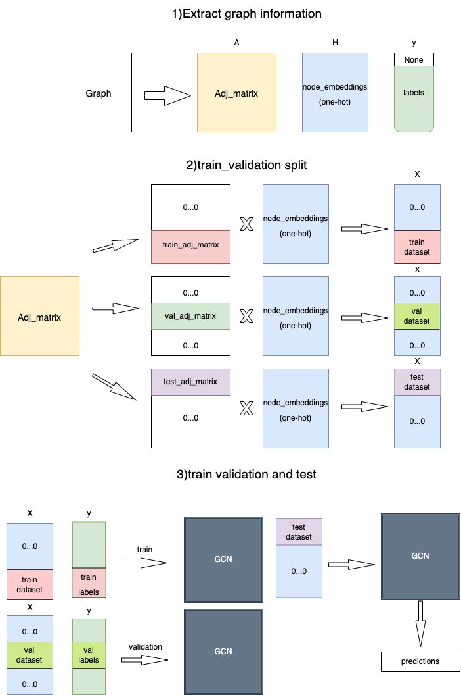
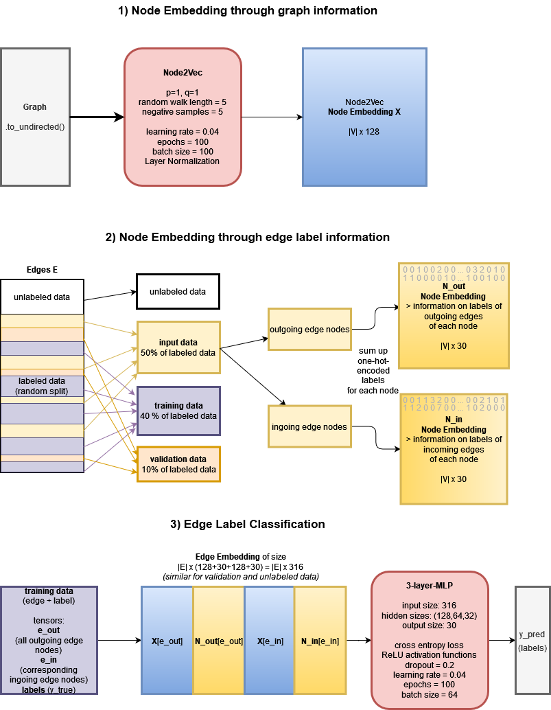

# Graph Learning
This readme is used to describe how to run our code and the results we obtained in each exercise.

## Structure of the repository of exercise 5

The repository contains three folders called ex_5 CITE, ex_5 HOLU and ex_5 LINK. Each of the models in these folders are to be run seperately. Therefore, we describe the models one after another in this Readme.

# HOLU

## Structure of ex_5 HOLU 

The repository contains several different files: \
\
&nbsp; &nbsp; 0. main.py: main file to run other codes. \
&nbsp; &nbsp; 1. custom_Dataset.py: This file contains the custom dataset class. \
&nbsp; &nbsp; 2. collate_graphs.py: This file contains the collate function. \
&nbsp; &nbsp; 3. GNN_Layer.py: This file implements a GNN layer.\
&nbsp; &nbsp; 4. Sparse_Sum_Pooling.py: This file implements a sparse sum pooling layer.\
&nbsp; &nbsp; 5. Virtual_Node.py: This file implements a Virtual Node Modul. \
&nbsp; &nbsp; 6. GNN.py: This file implements a GNN with all its different layers. \
&nbsp; &nbsp; 7. Train_GNN.py: This file contains a function with the training loop and an evaluation function for the GNN. \

## How to run the script

This script uses argparse. \
\
To run the script it is necessary to call the file 'main_HOLU.py'. 
It is required to choose the following arguments: \
\
REQUIRED ARGUMENTS
- data path (-ptr): path to get the data

\
OPTIONAL ARGUMENTS
- dimension of hidden layers (-dim), default=64
- type of aggregation (-type), choose between sum, mean and max, default="sum"
- number of layers (-layers), default=5
- dropout rate (-drop_out), default=0.0
- if virtual nodes should be used (-virtual), default=False
- number of training epochs (-epochs), default=100
- batch size during training (-size), default=100
- learning rate for training (-lr)', default=0.004

## Motivation for the HOLU dataset

Due to the similarity of this task with exercise sheet 3 we decided to use this GNN model as template and and to not consider further methods.

## Model description for HOLU
This model consists of a Custom Dataset, a Custom Collation function, and a GNN layer, where we also implemented a Sparse Sum Pooling and a Virtual Node module.\
The Custom Dataset represents each graph in the dataset by using sparse representation. The representation consists of the directed edge list, the node feature matrix, the edge feature matrix and the graph label, as described in exercise sheet 3. Additionally, it also has node attributes, which are the atom positions as 3D real vectors. We used them to compute the distance of two nodes which are connected by an edge and concatenated this distance to the respective one-hot-encoded edge label.\
The Custom Collation function takes as input the list of sparse representations of the graphs, outputted by the Custom Dataset, and outputs a sparse representation of the disjoint union graph, which merges all graphs into one.\
The GNN layer initializes the graph level GNN with several GNN layers, Virtual Node if requested, Sparse Sum Pooling if requested and an MLP with one hidden layer and Relu activation. Further, it supports SUM, MEAN and MAX aggregation, which are passed to the layer in the constructor. 

In order to get training and validation data we first split the dataset in labeled and not labeled data, where the latter is used as test data. The labeled data is randomly sampled into 80% of training data and 20% of validation data.

## Results HOLU
We achieved the best result with the above described default values.

| HOLU dataset     | mean MAE      | standard deviation |
|------------------|-----------|--------------------|
| training data    |  0.3462 |  0.0138765          |
| validation data  |  0.3522 | 0.0247364            | 

  

# CITE

## Structure of ex_5 CITE 

The repository contains several different files: \
\
&nbsp; &nbsp; 0. main.py: main file to run other codes. \
&nbsp; &nbsp; 1. load_data.py: This file contains functions to get adj_matrix,node_embeddings and node_labels. \
&nbsp; &nbsp; 2. GCN_Layer.py: This file implements a GCN layer. \
&nbsp; &nbsp; 3. GCN.py: This file implements a whole GCN .\
&nbsp; &nbsp; 4. train_GCN.py: This file implements ShuffleSplit to split train and validation dataset and .\

## How to run the script

This script uses argparse. \
\
To run the script it is necessary to call the file 'main.py'. 
It is required to choose the following arguments: \
\
REQUIRED ARGUMENTS
- data path (-path): path to get the training data

\
OPTIONAL ARGUMENTS
- dimension of hidden layers (-hidden_dim), default=64
- number of layers (-num_layers), default=3
- Validation set percentage (-test_size), default=0.2
- number of training epochs (-epochs), default=100
- learning rate for training (-lr)', default=0.001

## Model description for CITE

The model consists of three parts. The first one extract the adj_matrix,node_embeddings and labels from given Graph.The second part is train_validation split.In order not to use all the node_embeddings as train dataset,we set part of the rows of adj_matrix to 0,which means these nodes pass no message to other nodes,i.e we do not use them in the training phase,the same goes for the validation dataset.At last we use ShuffelSplit to make 10-fold cross_validation and predict the result using the trained model. 

## Motivation for the chosen model for the CITE dataset
The first thing that comes to mind is to train a word embeddings model based on the given data. For the predicted node, take out the word embeddings belonging to the node's words, merge and predict.However, this method cannot use the connectivity of the edge, even if the edge has no attributes, there should be a relation between the two connected nodes.\

Then, since this task is very similar to the node_level_GCN of exercise 2, So I built a similar model.The only difference is that in exercise 2, we have separate training set and test set, but in this task, there is only one graph, so how to divide this graph into training set and validation set is critical,which is explained in the previous part.
Because this model takes into account both node_attributes and edge connectivity, so this is a better model. For the parameters of GCN, the default values given above are good parameters. Too many epochs and too high hidden_dimension will lead to overfitting of the model.

## Results CITE

The model was executed 10 times, the corresponding statistics are as follows:

| CITE dataset     | mean      | standard deviation |
|------------------|-----------|--------------------|
| training data    |  0.800512 |  0.013064          |
| validation data  |  0.772592 |  0.014623          | 

  

# LINK

## Structure of ex_5 LINK

The repository contains several different files: \
\
&nbsp; &nbsp; 0. main.py: main file to run other codes. \
&nbsp; &nbsp; 1. random_walks.py: implements Iterable Dataset for Node2Vec, based on random walks \
&nbsp; &nbsp; 2. node2vec.py: implements Node2Vec torch module \
&nbsp; &nbsp; 3. train_node2vec.py: implements training loop for Node2Vec, returns the node embedding \
&nbsp; &nbsp; 4. modify_data.py: contains functions to modify the edges, to split the edge data into input, training, validation and test data (edge_split) and to create the edge embedding (concatenation) \
&nbsp; &nbsp; 5. MLP.py: implements a 3-layer MLP (MLP class, training and validation) \
&nbsp; &nbsp; 6. classification.py: contains the code which coordinates Node2Vec and MLP and performs test label classification (returns list of test edge predictions) \

## How to run the script

This script uses argparse. \
\
To run the script it is necessary to call the file 'main.py'. 
It is required to choose the following arguments: \
\
REQUIRED ARGUMENTS
- data path (-path): path to get the LINK graph

\
OPTIONAL ARGUMENTS
- edge input percentage (-input_perc): percentage of edges that should be used as input for the classification, default = 0.5
- edge validation percentage (-validation_perc): percentage of edges that should be used as validation for the classification (rest of the labeled edges are used as training edges), default = 0.1
- hidden layer sizes (-hidden_layer_sizes): size of three hidden layers of the classification MLP, default = (128,64,32)
- learning rate of MLP (-lr), default = 0.4
- batch size of MLP (-batch_size), default = 64
- number of epochs of MLP (-epoch), default = 100
- save_matrix (-save_matrix): True if you want to use a precomputed node embedding matrix instead of Node2Vec embedding (has to be of hidden size 128), default = False

## Model description for LINK

The model consists of three parts. The first two parts compute different node embeddings. The edge embeddings are computed by concatenating the embeddings for the edge nodes (first concatenate embedding for outgoing edge nodes, then concatenate embedding of incoming edge nodes and then concatenate both). The edge classification is done as a third step, there a simple 3-layer MLP is used, with the edge embeddings as input and the classification of the edges as output.

Comment on multiedges: There were in total 77 multiedges (2 edges between the nodes) in the dataset, of whom 7 were in the test data (label: None). We paid attention that at least one of the two nodes of a multiedge were assigned to the input edges, i.e. that at most one edge between two nodes is used for classification. E.g. the edge labels of those edges which had as second label "None" were assigned to the input_edges data. 

## Motivation for the chosen model for the LINK dataset

The advantage of using both Node2Vec and edge labels as input for the edge embeddings is that it takes both the structure of the graph (degree distribution, connectedness) and the type of the edges into account. We also considered just using Node2Vec or just using an MLP for edge classification, but this would either neglect that we have edge labels or that our data is structured in a graph. \
The way we chose our model, the node embeddings derived through Node2Vec work on the graph information without the edge labels. Moreover, the graph is changed to an undirected representation, as this makes the Node2Vec algorithm easier. Otherwise, one would have to consider that some nodes might have an in-degree greater than 0, but an out-degree equal to 0, so that many sampled paths don't get to a length of 5 nodes. By changing the graph to undirected during Node2Vec, we lose some information. However, the final edge embedding considers the direction of the edges, as the node embeddings of the respective nodes are concatenated (and not multiplied (Hadamard product), as was the case in exercise 4). Thus, we decided that the information loss could be neglected. \
We also considered using one GNN for the edge classification which first computes node embeddings, then performs the edge embedding and afterwards classifies the edges, but were a bit unsure whether the concatenation to edge embeddings in the middle would work within the GNN. As the Node2Vec approach was more straightforward, we chose to implement this option.

## Results LINK

The model was executed 5 times, the corresponding statistics are as follows:

| LINK dataset     | mean      | standard deviation |
|------------------|-----------|--------------------|
| training data    |  0.876396 |  0.002706          |
| validation data  |  0.854713 |  0.015241          | 

